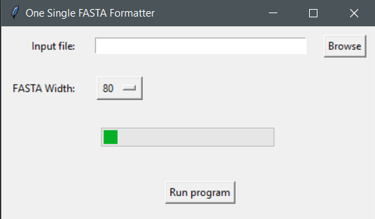

# One-Single-FASTA-Formatter

A lightweight ultrafast x86_64 windows gui app to change the width of a single fasta file in place

## Usage

1. Download the file from the `bin` folder.
2. Click `Browse` to select an input single-fasta file.
3. Select FASTA width from the dropdown menu.
4. Press `Run program` to execute.

## Notes

1. Example input/output files can be seen in the `data` folder.
2. Input file can have long description that won't be afected by the wrapping.
3. Input file was downloaded from solgenomics.net.
